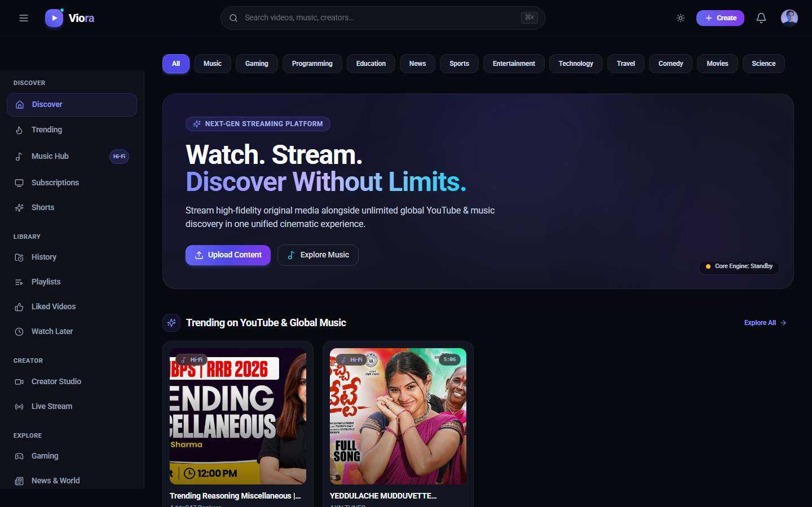
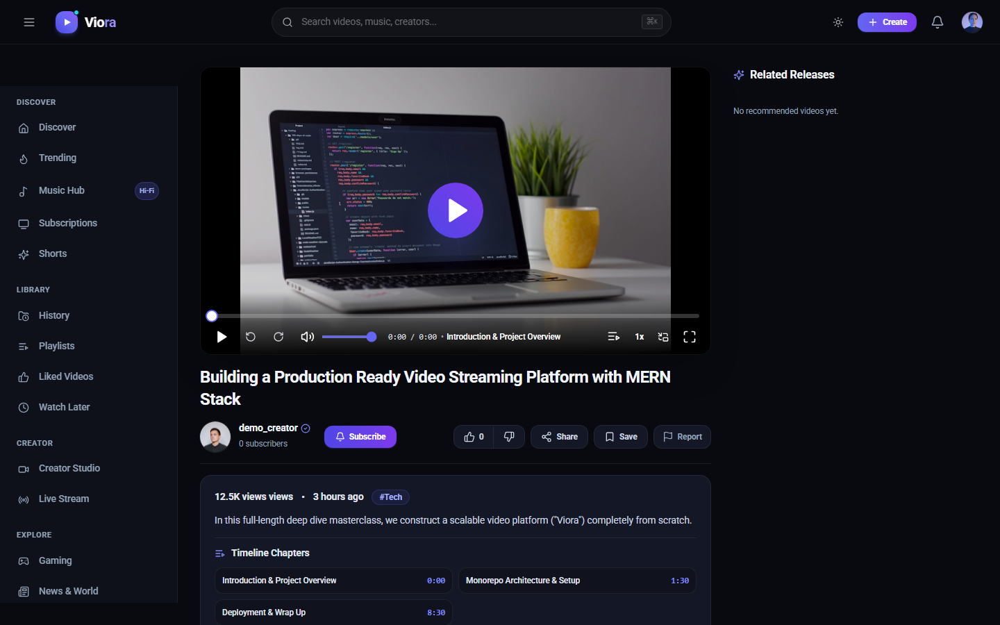
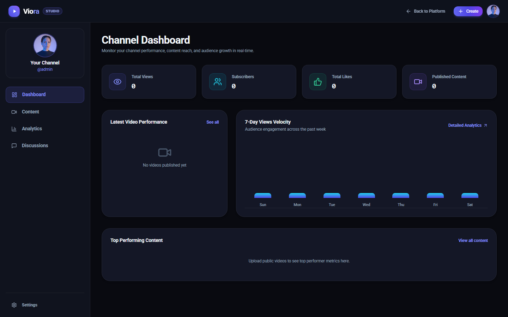
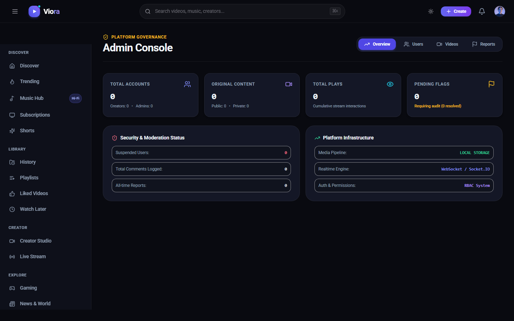
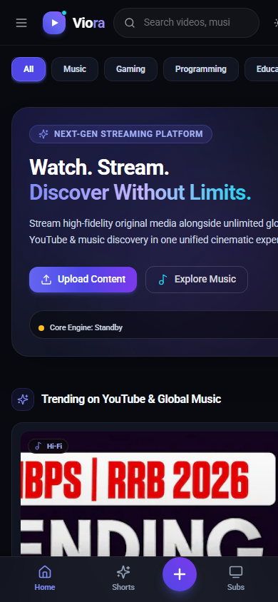

# 🎬 Viora — Watch. Listen. Discover.

<div align="center">


**A next-generation, cinematic video and music streaming platform engineered with the MERN stack, Tailwind CSS, Redux Toolkit, and WebSockets.**

[Interface Showcase](#-interface-showcase) • [Explore Features](#-core-features) • [Architecture](#-architecture) • [Getting Started](#-getting-started) • [API Documentation](#-api-endpoints) • [Docker Deployment](#-docker-deployment)

<br />



</div>

---

## 📖 Overview

**Viora** is a full-featured video and music discovery platform designed for high performance, rich social interaction, and media consumption. It combines the capabilities of a local video-sharing community with a **live hybrid search engine** that connects users to global YouTube videos and music in real time.

Built with an **8px spacing grid, elevated charcoal surfaces, and sophisticated violet/indigo and cyan accents**, Viora delivers a production-grade experience with a zero-copycat, dark-first visual identity.

```text
                                 ┌─────────────────────────────────┐
                                 │       Viora Frontend (SPA)      │
                                 │   React 18 • Vite • Tailwind    │
                                 │    Redux Toolkit • Socket.IO    │
                                 └───────────────┬─────────────────┘
                                                 │
                             REST API (HTTP)     │     Live Alerts (WebSockets)
                                                 ▼
                                 ┌─────────────────────────────────┐
                                 │     Viora Core API (Node.js)    │
                                 │    Express • JWT • Multer       │
                                 └───────┬──────────────┬──────────┘
                                         │              │
                    ┌────────────────────┴──┐        ┌──┴────────────────────┐
                    ▼                       ▼        ▼                       ▼
            ┌───────────────┐     ┌───────────┐ ┌───────────────┐   ┌────────────────┐
            │ MongoDB Atlas │     │ Media Cdn │ │ YouTube API   │   │  Socket.IO     │
            │  (Database)   │     │(Cloudinary│ │(Live Search & │   │  (Presence &   │
            │               │     │  & Disk)  │ │  Metadata)    │   │ Notifications) │
            └───────────────┘     └───────────┘ └───────────────┘   └────────────────┘
```

---

## 📸 Interface Showcase

### 🏠 Home Page & Discovery Feed
Unified discovery billboard showcasing featured releases alongside global YouTube & music trends:
<p align="center">
  
</p>

<br />

| 🎥 Video & Cinema Player | 💼 Creator Studio |
|:---:|:---:|
|  |  |
| *Custom HTML5/HLS cinema player with timeline chapters, subtitles, and speed controls* | *Real-time analytics dashboard, audience velocity charts, and catalog management* |

<br />

| 🛡️ Platform Governance & Admin | 📱 Mobile Experience |
|:---:|:---:|
|  |  |
| *Role-based governance, abuse reporting pipeline, and platform telemetry* | *Ultra-responsive mobile layout with bottom navigation and fluid touch targets* |

---

## ✨ Core Features

### 🔍 1. Hybrid Search & Discovery Engine
* **Unified Dual Pipeline**: Seamlessly searches local MongoDB originals while querying the **YouTube Data API v3** in real time for external music tracks, artists, and videos.
* **Segmented Filtering**: Instant tab toggling between **All Sources**, **Viora Originals**, and **YouTube & Music**.
* **Smart Attribution**: Results feature clear creator badges (`Viora Original` vs. `YouTube Partner`), view counts, upload dates, and duration pills.

### 🎥 2. Cinematic Media Playback
* **HTML5 Cinema Player**: Custom-built media player with a theater mode backdrop and zero browser player chrome.
* **Interactive Seekbar Chapters**: Timestamp markers along the scrub bar with hover previews and active chapter drawer jump navigation.
* **Multi-Language Subtitles (CC)**: Dynamic WebVTT caption loader with an on-the-fly language switcher and `C` keyboard shortcut.
* **Precision Speed Control**: Granular playback rates (`0.5x`, `0.75x`, `1x`, `1.25x`, `1.5x`, `2x`).
* **Resilient Watch Progress**: Throttled position synchronization to `/api/progress/:videoId` with automatic session resumption (e.g., `?t=124s`).
* **Continue Watching Shelf**: Personalized progress carousel on the home feed with percentage bars and one-click dismiss.
* **YouTube Player Integration**: Automatic fallback player iframe for external music and video discovery.

### 🎵 3. Music & Audio Experience
* **Dedicated Music Cards**: Square album artwork layout with vinyl grooves, animated equalizer waves, and floating quick-play triggers.
* **Trending Music Shelf**: Dedicated home rail for trending singles, albums, and curated artist tracks.

### 💼 4. Viora Creator Studio (`/studio`)
* **Analytics Dashboard**: 4 KPI stat cards (Total Views, Estimated Watch Hours, Subscribers, and Engagement Rate).
* **7-Day Audience Velocity Chart**: Interactive bar chart powered by indigo-to-cyan visual metrics.
* **Content Management**: Sortable video catalog table with status tags (`Public`: emerald, `Unlisted`: amber, `Private`: slate), view counts, and quick actions.
* **Comment Moderation Suite**: Dedicated channel moderation console for reviewing, engaging with, and deleting comments.
* **Publishing Pipeline**: Video upload modal with drag-and-drop file staging, live progress bars, automated thumbnail selection, and chapter definitions.

### 🛡️ 5. Platform Governance & Administration (`/admin`)
* **Role-Based Access Control (RBAC)**: Strict authorization hierarchy supporting `user`, `creator`, and `admin` roles.
* **Instant Suspension Enforcement**: Real-time account suspension (`isSuspended: true`) enforced on all authenticated routes.
* **User Management Console**: Searchable user directory with inline role promotions and suspension toggles.
* **Abuse & Moderation Pipeline**: Report handling system (`/api/reports`) with categorized reasons (copyright, spam, harassment, violence) and an administrative review workflow (`pending`, `reviewing`, `resolved`, `dismissed`).

### 📚 6. Personal Library & Engagement
* **Liked Videos & Watch Later**: Curated queue pages with radial gradient hero covers and tracklist management.
* **Playlists**: Custom playlist builder with visibility settings (`public`, `unlisted`, `private`) and inline metadata editing.
* **Watch History**: Grouped chronological timeline (*Today*, *Yesterday*, *Older*) with single-item removal and full history wipe.
* **Subscriptions Rail**: Horizontal creator avatar scrollbar with glowing indigo rings on hover.
* **Real-Time Notifications**: Bi-directional Socket.IO alerts for likes, subscriptions, and comment replies.

---

## 🎨 Design System

Viora avoids generic video platform copycat aesthetics in favor of a **minimalist, dark-first design language**:

| Token | Hex Value | Usage |
|---|---|---|
| `viora-bg` | `#090a10` | Deep near-black charcoal canvas |
| `viora-surface` | `#10131e` | Frosted glass headers, sidebars, sheets |
| `viora-card` | `#141726` | Elevated cards, panels, list items |
| `viora-border` | `rgba(255, 255, 255, 0.05)` | Ultra-fine subtle surface separators |
| `accent-primary` | `#6366f1` / `#7c3aed` | Violet & Indigo buttons, active indicators |
| `accent-discovery`| `#06b6d4` | Electric Cyan for music and live streams |
| `text-primary` | `#f8fafc` | High-contrast crisp white typography |
| `text-muted` | `#94a3b8` / `#64748b` | Muted slate secondary labels and metrics |

---

## 🛠️ Technology Stack

```text
├── Frontend
│   ├── React 18 (Concurrent Features)
│   ├── Vite (Ultra-fast HMR & Build)
│   ├── Tailwind CSS (Design Tokens & Glassmorphism)
│   ├── Redux Toolkit (State Management & Slices)
│   ├── React Router v6 (Nested SPA Routing)
│   ├── Lucide React (Icons)
│   └── Socket.IO Client (Real-time events)
│
├── Backend
│   ├── Node.js & Express.js (RESTful API & Middleware)
│   ├── MongoDB & Mongoose (NoSQL Data Models)
│   ├── Socket.IO (Authenticated WebSocket Rooms)
│   ├── Multer (Multi-part Media Uploads)
│   ├── Cloudinary SDK & Local Storage (Media Pipeline)
│   └── JSON Web Tokens & Bcryptjs (Authentication & Cryptography)
│
└── DevOps & Infrastructure
    ├── Docker & Docker Compose (Containerization)
    ├── Nginx (Reverse Proxy & SPA Static Server)
    └── GitHub Actions (Automated CI Pipeline)
```

---

## 📁 Repository Structure

```text
Viora/
├── client/                               # React 18 Frontend Application
│   ├── src/
│   │   ├── components/
│   │   │   ├── channel/                  # SubscribeButton, ChannelHeader
│   │   │   ├── comments/                 # CommentSection, CommentItem
│   │   │   ├── common/                   # ProtectedRoute, AdminRoute, ErrorBoundary
│   │   │   ├── layout/                   # Header, Sidebar, MobileBottomNav, NotificationDropdown
│   │   │   ├── ui/                       # Button, Badge, Card, Skeleton primitives
│   │   │   └── video/                    # VideoCard, MusicCard, VideoPlayer, UploadModal, etc.
│   │   ├── layouts/                      # AppLayout, StudioLayout
│   │   ├── pages/                        # Home, Watch, Search, Studio, Admin, Playlists, etc.
│   │   ├── services/                     # Axios API clients, WebSocket client, YouTube service
│   │   ├── store/                        # Redux Toolkit store and slices (authSlice, themeSlice)
│   │   └── index.css                     # Tailwind design tokens, glass utilities, custom scrollbar
│   ├── tailwind.config.js                # Theme extension and color tokens
│   └── vite.config.js                    # Vite configuration and proxy rules
│
├── server/                               # Express.js REST & Real-Time API
│   ├── src/
│   │   ├── config/                       # Database connection, Cloudinary, Database Seed
│   │   ├── controllers/                  # Auth, Video, User, Comment, Studio, Admin, Progress
│   │   ├── middleware/                   # RBAC Auth, Suspension Check, Multer, Error Handler
│   │   ├── models/                       # User, Video, Comment, Playlist, Report, WatchProgress
│   │   ├── routes/                       # Express router endpoints
│   │   ├── services/                     # Hybrid search, media providers, notifications
│   │   ├── sockets/                      # Socket.IO connection and private user rooms
│   │   ├── app.js                        # Express app setup and middleware stack
│   │   └── server.js                     # HTTP & WebSocket server entrypoint
│   └── package.json
│
├── docker-compose.yml                    # Multi-container service configuration
├── package.json                          # Monorepo orchestration scripts
└── README.md                             # Project documentation
```

---

## 🚀 Getting Started

### Prerequisites
* **Node.js**: `v18.x` or `v20.x` or higher
* **npm**: `v9.x` or higher
* **MongoDB**: Local MongoDB instance (`mongodb://127.0.0.1:27017/viora`) or a MongoDB Atlas URI
* *(Optional)* **YouTube Data API Key**: Required for live YouTube search discovery

---

### 1. Clone the Repository

```bash
git clone https://github.com/VinayKrishna-7/Viora.git
cd Viora
```

---

### 2. Install Dependencies

Install root, server, and client dependencies with a single command:

```bash
# Install root dependencies
npm install

# Install server dependencies
cd server && npm install && cd ..

# Install client dependencies
cd client && npm install && cd ..
```

---

### 3. Environment Configuration

Create a `.env` file in the `server/` directory:

```bash
# In server/.env
PORT=5000
NODE_ENV=development
MONGO_URI=mongodb://127.0.0.1:27017/viora
CLIENT_URL=http://localhost:5173

# JWT Security
JWT_SECRET=your_random_secret_here
JWT_EXPIRE=7d
COOKIE_EXPIRE=7

# Media Storage Provider (local or cloudinary)
MEDIA_STORAGE_PROVIDER=local
UPLOAD_DIR=./uploads

# (Optional) YouTube Data API v3 for live search discovery
YOUTUBE_API_KEY=your_youtube_api_key_here

# (Optional) Cloudinary Credentials (if MEDIA_STORAGE_PROVIDER=cloudinary)
CLOUDINARY_CLOUD_NAME=your_cloud_name
CLOUDINARY_API_KEY=your_api_key
CLOUDINARY_API_SECRET=your_api_secret
```

Create a `.env` file in the `client/` directory *(optional for custom API ports)*:

```bash
# In client/.env
VITE_API_URL=http://localhost:5000/api
VITE_SOCKET_URL=http://localhost:5000
```

---

### 4. Seed the Database (Local Development Only)

Populate sample channels, videos with chapters, WebVTT subtitles, playlists, and notifications for local development testing:

```bash
npm run seed
```

> **Security Note**: Database seeding is strictly disabled in production environments by default. When deploying to production or providing evaluation access to recruiters, create accounts directly via the `/register` portal with appropriate, limited permissions, and ensure custom environment credentials (`ADMIN_SEED_PASSWORD`, `JWT_SECRET`) are configured.

---

### 5. Run Development Servers

Start both the backend API and frontend client concurrently:

```bash
npm run dev
```

* **Frontend Application**: [http://localhost:5173](http://localhost:5173)
* **Backend REST & WebSocket API**: [http://localhost:5000](http://localhost:5000)
* **Health Check**: [http://localhost:5000/api/health](http://localhost:5000/api/health)

---

## 🔌 API Endpoints

### Authentication & Users
* `POST /api/auth/register` — Register a new user account
* `POST /api/auth/login` — Authenticate and receive JWT cookie
* `POST /api/auth/logout` — Clear session
* `GET /api/users/me` — Retrieve current authenticated user profile
* `PUT /api/users/profile` — Update username, avatar, banner, or description
* `PUT /api/auth/change-password` — Change password

### Video Catalog & Playback
* `GET /api/videos` — Retrieve paginated video feed with filters
* `GET /api/videos/:id` — Retrieve video metadata, chapters, and owner info
* `POST /api/videos` — Upload new video with media and thumbnail *(Multipart)*
* `PUT /api/videos/:id` — Update video title, description, category, or visibility
* `DELETE /api/videos/:id` — Delete video and cascade interactions
* `POST /api/progress/:videoId` — Update throttled watch progress timestamp
* `GET /api/progress/continue-watching` — Retrieve in-progress watch queue

### Hybrid Search
* `GET /api/search?q=:query` — Hybrid search querying MongoDB + YouTube Data API
* `GET /api/search/youtube?q=:query` — Direct YouTube video and music query

### Creator Studio & Analytics
* `GET /api/studio/dashboard` — Retrieve views, watch time, subscribers, and 7-day velocity
* `GET /api/studio/content` — Manage published videos and visibility states
* `GET /api/studio/comments` — Moderate channel-wide comment threads

### Interactions & Playlists
* `POST /api/interactions/videos/:id/like` — Toggle like/dislike on video
* `POST /api/subscriptions/:channelId` — Toggle subscription to channel
* `GET /api/playlists` — Retrieve user playlists
* `POST /api/playlists` — Create new playlist
* `GET /api/playlists/:id` — Retrieve playlist details and tracklist

### Moderation & Administration
* `GET /api/admin/stats` — Platform metrics and system health indicators
* `GET /api/admin/users` — Searchable user directory with suspension status
* `PUT /api/admin/users/:id/role` — Update user role (`user`, `creator`, `admin`)
* `PUT /api/admin/users/:id/suspend` — Toggle account suspension
* `GET /api/reports` — View moderation reports queue
* `PUT /api/reports/:id` — Resolve or dismiss content report

---

## 🐳 Docker Deployment

Run the entire stack with Docker Compose:

```bash
# Build and run MongoDB, Express Server, and Nginx-backed Client
docker-compose up --build -d
```

* **Client Web Application**: `http://localhost:3000`
* **API Backend**: `http://localhost:5000`
* **MongoDB Instance**: `localhost:27017`

To stop containers:
```bash
docker-compose down
```

---

## 📦 Production Build

To create an optimized production build of the frontend:

```bash
cd client
npm run build
```

Assets will be output to the `client/dist/` directory, ready to be served by any static web server or CDN.
